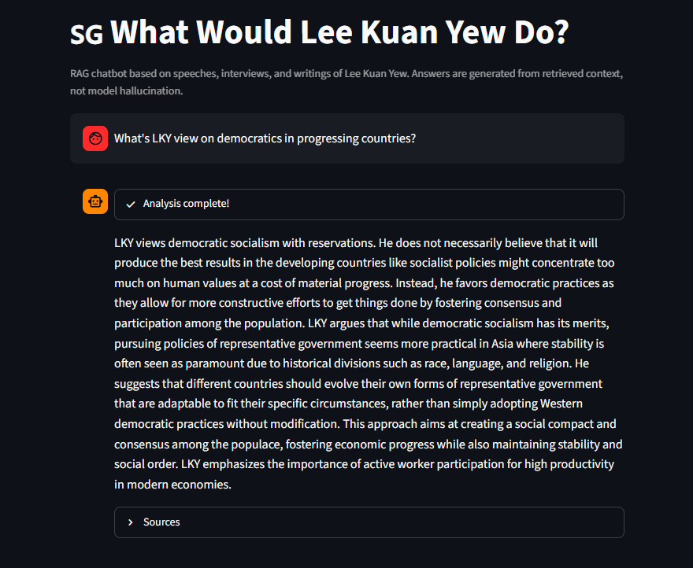

# What Would Lee Kuan Yew Do? 🇸🇬

A retrieval-augmented generation (RAG) chatbot that answers questions in the voice of Lee Kuan Yew — grounded **strictly** in his actual speeches, interviews, and writings from the National Archives of Singapore (NAS).

Every answer is generated from retrieved source documents, with citations. If the corpus contains no relevant passage, the model is instructed to say so rather than improvise.

Runs entirely on local infrastructure: local embedding model, local vector database, local LLM via Ollama. No API keys, no data leaves the machine.

---

## Demo

**Question → grounded answer**



The UI streams a three-step trace as it works: vector search → context assembly → LLM generation.

**Retrieved sources with similarity scores**


Every answer expands to show which speeches it drew from, their dates, and their cosine similarity scores — so any claim can be traced back to a primary document.

---

## Corpus

Built from a full crawl of NAS speeches filtered by speaker "Lee Kuan Yew":

| Stage | Count |
|---|---|
| Records discovered | 1,328 |
| PDFs downloaded | 1,156 |
| Markdown documents produced | 1,158 |
| Embedded chunks indexed | 5,700 |

Coverage spans roughly 1955–2011 — parliamentary speeches, foreign policy addresses, university lectures, and press interviews.

---

## Architecture


**Component choices**

| Concern | Choice | Why |
|---|---|---|
| Crawling | Scrapy 2.13 | Built-in retry, throttling, resumable file pipeline |
| PDF extraction | poppler `pdftotext -layout` | Preserves column layout in scanned government documents |
| Chunking | 700 tokens, 100-token overlap | Tokenized with the *embedding model's own* tokenizer, so chunk sizes match what actually gets embedded |
| Embeddings | `BAAI/bge-m3` (1024-dim) | Strong multilingual retrieval — the corpus is English, but queries can be Indonesian |
| Vector DB | Qdrant, embedded mode | File-based, no server process needed for local use |
| Generation | `qwen2.5:3b` via Ollama | Small enough to run on modest hardware; the grounding does the heavy lifting, not the model's world knowledge |
| UI | Streamlit | Chat primitives out of the box |

---

## Pipeline

Each stage is a standalone script, run from the project root in order. All stages are idempotent — re-running skips work already done.

### Stage 1 — Crawl record metadata

```bash
scrapy crawl nas_speeches -O data/records.jsonl
scrapy crawl nas_speeches -a last_page=3 -O data/records.jsonl   # quick test run
```

Paginates the NAS advanced-search results (20 items/page), extracting `uid`, `title`, `speaker`, `date`, `source`, `record_url`, and attachment URLs. Duplicate `uid`s across overlapping pages are dropped by `DedupeSummaryPipeline`.

> **Note:** NAS sits behind a WAF that returns `202` with an empty body to browser-like user agents but serves plain HTML to `curl`. `settings.py` therefore sets `USER_AGENT = "curl/8.0"`. Requests are rate-limited to 1 concurrent request with a 1-second delay, and a contact address is sent in the `From` header.

### Stage 2 — Download PDFs

```bash
scrapy crawl nas_pdfs
```

Reads `records.jsonl` locally (crawls nothing) and hands URLs to a subclassed `FilesPipeline`, which stores files as `data/pdfs/<uid>/<original-name>.pdf` instead of hash-based names, keeping every file traceable back to its record. Existing files are skipped.

### Stage 3 — Extract text

```bash
python extract.py
```

Runs `pdftotext -layout` over every PDF. **Requires poppler on `PATH`:**

- Windows — download [poppler for Windows](https://github.com/oschwartz10612/poppler-windows/releases), add its `Library\bin` to `PATH`, then open a **new** terminal
- macOS — `brew install poppler`
- Linux — `apt install poppler-utils`

### Stage 4 — Convert to Markdown

```bash
python markdown.py
```

Wraps each text file in YAML frontmatter (`uid`, `title`, `speaker`, `date`, `source`, `record_url`, `source_file`) joined from `records.jsonl`, and collapses the runs of blank lines that `pdftotext` leaves behind. Files whose `uid` has no matching record are skipped.

### Stage 5 — Chunk

```bash
python chunk.py
python chunk.py --limit 20     # quick preview on 20 documents
```

Slices each document into 700-token windows with 100-token overlap using the bge-m3 tokenizer, writing one JSON object per chunk to `data/chunks.jsonl` with all document metadata carried through. The redundant `# Title` heading is stripped first so it doesn't consume token budget.

### Stage 6 — Embed and index

```bash
python index.py
```

Embeds chunks in batches of 8 and upserts them into the `lky_speeches` Qdrant collection (cosine distance). Uses CUDA with fp16 if available, otherwise CPU.

**Resumable by design:** progress is checkpointed to `data/embed_progress.json` after every batch. `Ctrl+C` is safe — re-running picks up exactly where it stopped instead of re-embedding from scratch.

---

## Running the chatbot

### Prerequisites

1. **Python 3.10+**
2. **Ollama** running locally with the generation model pulled:
   ```bash
   ollama pull qwen2.5:3b
   ```
3. **A populated index** — either run the pipeline above, or supply an existing `data/qdrant_db/`.

### Install

```bash
python -m venv .venv
.venv\Scripts\activate          # Windows
# source .venv/bin/activate     # macOS / Linux

pip install -r requirements.txt
```

> **CPU-only PyTorch:** the default `torch` wheel pulls ~4 GB of bundled CUDA libraries. Since inference here runs on CPU, install the CPU build first to save the download and disk space:
> ```bash
> pip install torch --index-url https://download.pytorch.org/whl/cpu
> ```

### Web UI

```bash
streamlit run app.py
```

Opens at http://localhost:8501.

### Command line

```bash
python cli.py "What is your view on meritocracy?"
```

Prints the answer followed by the retrieved sources and their scores.

### Docker

```bash
docker-compose up -d --build
```

Starts Qdrant in server mode plus the Streamlit app. The app container reaches Ollama on the host via `host.docker.internal:11434`, so **Ollama must still be running on the host machine.**

Note that `docker-compose.yml` sets `QDRANT_URL`, which switches `core.py` from embedded mode to server mode — meaning the containerized stack needs its own index built against the Qdrant service. Local (non-Docker) runs leave `QDRANT_URL` unset and read `data/qdrant_db/` directly.

---

## Evaluation

Two evaluation scripts cover the two failure modes that matter in RAG: *retrieving the wrong passage*, and *generating claims the passage doesn't support*.

### Retrieval quality — Recall@K and MRR

```bash
python test_retrieval.py
```

Runs a hand-labeled test set of 10 questions, each paired with the `uid` of the record that should answer it, and reports **Recall@5** (was the right document retrieved at all?) and **MRR** (how high did it rank?).

Questions are deliberately written in Indonesian against an English corpus, which doubles as a check on bge-m3's cross-lingual retrieval.

To extend the test set, find `uid`s by searching record titles:
```bash
grep -i "meritocracy" data/records.jsonl
```

### Groundedness — LLM-as-judge

```bash
python eval_llm.py
```

For each test question, retrieves context, generates an answer, then asks a second LLM pass to rule on whether the answer is factually supported by that context. Prints any question where the verdict comes back negative. Persona rephrasing is explicitly permitted by the judge prompt — only unsupported *facts* count as hallucination.

### Chunking sanity checks

```bash
python preview_chunks.py                # stats + random sample chunks
python preview_chunks.py --short 50     # flag suspiciously short chunks (OCR noise)
python preview_chunks.py --uid <uid>    # inspect every chunk of one record
python chunk_quality_report.py          # mid-sentence cuts, junk-character ratio
```

These are heuristics, not ground truth — they catch obvious extraction damage before you spend hours embedding it. `test_retrieval.py` remains the metric that actually matters.

---

## Project structure

```
nas_speech/
├── nas_speech/                 # Scrapy project
│   ├── settings.py             # WAF-friendly UA, throttling, pipelines
│   ├── pipelines.py            # uid dedupe + uid-based PDF file paths
│   └── spiders/
│       ├── nas_speeches.py     # Stage 1 — record metadata
│       └── nas_pdfs.py         # Stage 2 — PDF download
├── extract.py                  # Stage 3 — pdftotext
├── markdown.py                 # Stage 4 — Markdown + frontmatter
├── chunk.py                    # Stage 5 — token-window chunking
├── index.py                    # Stage 6 — embed + index (resumable)
├── core.py                     # Shared RAG logic: retrieve → context → generate
├── app.py                      # Streamlit UI
├── cli.py                      # Command-line interface
├── test_retrieval.py           # Recall@K / MRR
├── eval_llm.py                 # LLM-as-judge groundedness check
├── preview_chunks.py           # Chunk inspection
├── chunk_quality_report.py     # Chunk heuristics
├── Dockerfile
├── docker-compose.yml
└── data/                       # gitignored — regenerate with the pipeline
    ├── records.jsonl
    ├── pdfs/       text/       markdown/
    ├── chunks.jsonl
    ├── embed_progress.json
    └── qdrant_db/
```

`data/` is excluded from version control — it holds ~1,150 PDFs and a 17 MB chunk file. Regenerate it by running the pipeline.

---

## Configuration

Settings live as module constants rather than a config file. The ones worth knowing:

| Setting | File | Default |
|---|---|---|
| `CHUNK_TOKENS` / `OVERLAP_TOKENS` | `chunk.py` | 700 / 100 |
| `EMBED_MODEL` | `chunk.py`, `index.py`, `core.py` | `BAAI/bge-m3` |
| `BATCH_SIZE` | `index.py` | 8 (tuned for 4 GB VRAM — raise if you have headroom) |
| `OLLAMA_MODEL` | `core.py` | `qwen2.5:3b` |
| `TOP_K` | `core.py` | 5 |
| `DEVICE` | `core.py` | `"cpu"` (hardcoded; `index.py` auto-detects CUDA) |
| `SYSTEM_PROMPT` | `core.py` | Grounding directives + persona |

Environment variables (used by the Docker setup):

| Variable | Effect |
|---|---|
| `QDRANT_URL` | If set, connect to a Qdrant server. If unset, use embedded mode at `data/qdrant_db`. |
| `OLLAMA_URL` | Ollama chat endpoint. Defaults to `http://localhost:11434/api/chat`. |

If you change `EMBED_MODEL`, you must re-run `chunk.py` **and** `index.py` — the tokenizer, vector dimension, and existing collection all become invalid.

---

## Design notes

**Why grounding is enforced in the prompt, not just the retrieval.** A small model handed relevant context will still happily pad an answer with pretrained trivia about Singapore. The system prompt makes refusal the explicit fallback: if the context doesn't contain the answer, the model must return a fixed refusal string. `eval_llm.py` exists to verify it actually obeys.

**Why 700-token chunks tokenized with bge-m3.** Chunking with a *different* tokenizer than the embedding model is a common and invisible bug — chunks silently overflow the model's window and get truncated at embed time. Using the same tokenizer for both keeps the numbers honest.

**Why the index is resumable.** Embedding 5,700 chunks on CPU takes hours. A crash three hours in that forces a restart from zero makes the pipeline unusable in practice, so progress is checkpointed after every batch.

---

## Known limitations

- **PDF extraction quality varies.** Older scanned documents produce noisier text than modern digital PDFs. `chunk_quality_report.py` surfaces the worst offenders.
- **Fixed-size chunking cuts mid-sentence.** The 100-token overlap mitigates this but doesn't eliminate it; paragraph-aware chunking would read more naturally.
- **No reranking.** Top-5 vector hits go straight into the prompt. A cross-encoder reranker would improve precision at some latency cost.
- **No conversational memory in retrieval.** Each question is embedded on its own, so follow-ups like "what about after that?" retrieve poorly.
- **Scraper depends on a WAF quirk.** The `curl` user-agent workaround may stop working if NAS tightens its bot protection; the fallback would be a headless browser.

---

## Data source and attribution

All source documents come from the [National Archives of Singapore — Speeches](https://www.nas.gov.sg/archivesonline/speeches/) collection and remain the property of their respective rights holders.

This project is an independent, non-commercial technical demonstration of RAG architecture. It is **not** affiliated with, endorsed by, or representative of the National Archives of Singapore, the Government of Singapore, or the estate of Lee Kuan Yew. Generated answers are machine-produced approximations and must not be quoted as authentic statements — consult the linked primary sources instead.

The crawler identifies itself with a contact address and respects a 1-second delay with single-request concurrency.
